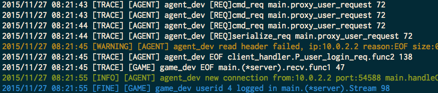

# nsq-logger
a generic logging service which push logging into nsqd

# why 
In distributed system, you cannot possibly check file logs on each server    

# how
each process(producer) send it's logs into a message backbone, like nsq, usually its sends to local nsqd, and consumers collect and analysis these logs centrally.    

# using with tailn

https://github.com/gonet2/tools/tree/master/tailn
